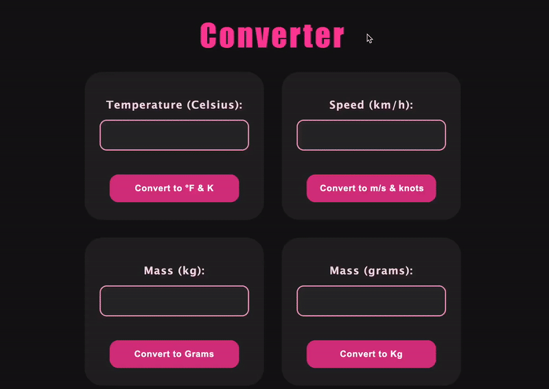

# 🌡️ PHP Measurement Converter
## 📘 Task Overview
A simple PHP app that converts temperature, speed and mass. Each type of conversion has its own input field and button. 

_____
### ✅ Features
* Temperature: Celsius → Fahrenheit & Kelvin
* Speed: km/h → m/s & knots
* Mass: kg → grams & grams → kg

____

### 🛠️ Tech Stack
* PHP
* CSS

## 🔄 Converter Demo

### 🔁 Preview

### 🎥 YouTube Demo

Watch it here: [https://www.youtube.com/watch?v=YoLm6zdyshA](https://www.youtube.com/watch?v=YoLm6zdyshA)
