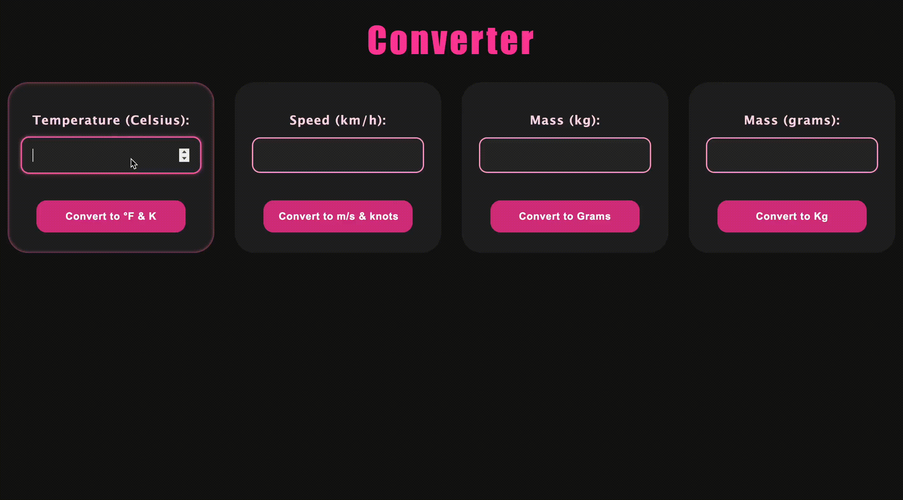

# 🌡️ PHP Measurement Converter
## 📘 Task Overview
A simple PHP app that converts temperature, speed and mass. Each type of conversion has its own input field and button. 

_____
### ✅ Features
* Temperature: Celsius → Fahrenheit & Kelvin
* Speed: km/h → m/s & knots
* Mass: kg → grams & grams → kg

____

### 🛠️ Tech Stack
* PHP
* CSS

---

## 🚀 Preview

  

Watch Full Demo on YouTube <a href="https://youtu.be/zJkc_XYV--E"> Here!
</a>
